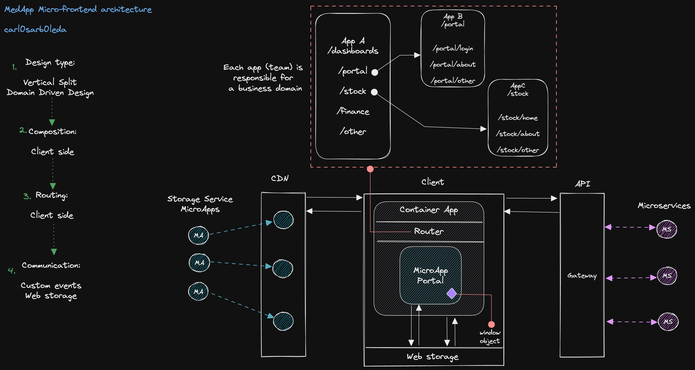

# Med App

Frontend application to display global medical dashboards and clinical portal
for health personnel.

This application has been designed as
[micro-app](https://martinfowler.com/articles/micro-frontends.html).

In production, the application can be built and placed in any storage service
like [AWS S3](https://aws.amazon.com/s3/) or
[Google storage](https://cloud.google.com/storage/docs/introduction) and be
served through a CDN. For this sample, we are using
[GitHub pages](https://docs.github.com/en/pages) to enable a public host that
serves the files needed to mount it in the container app.

## Micro-apps

This application can serve and route multiple micro-apps, for this sample the
following has been defined:

- [Portal app](https://github.com/carl0sarb0leda/microf-ca-app) ( App to handle
  clinicians and patients).

Author: Carlos Arboleda carlosaepn@gmail.com

## Tech Stack

- [TypeScript](https://www.typescriptlang.org/)
- [React](https://reactjs.org/)
- [Styled Components](https://styled-components.com/)
- [Chart JS](https://www.chartjs.org/)
- [Fontawesome](https://fontawesome.com/v5/docs/web/use-with/react)
- [Yarn](https://yarnpkg.com/)

The routing structure was implemented using
[React Router](https://reactrouter.com/en/main)

The application was built considering
[web accessibility standards](https://www.w3.org/WAI/)

## Structure

- `/api` contains the handlers to fetch api

- `/components` folder contains presentational components with styles

- `/containers` folder contains components with more focus on handling data and
  behavior

- `/lib` folder contains app enums

- `/router` folder contains the routing logic for protected paths

## Running the App

```shell
yarn start
```

This should start up your browser listen on PORT: 3301.

## Production Build

```shell
yarn build
```

Builds the app for production to the `build` folder.\
It correctly bundles React in production mode and optimizes the build for the best
performance.

The build is minified and the filenames include the hashes.\
Your app is ready to be deployed!

# Architecture v1.0.0



## Flows

1. As design type we use a
   [vertical split](https://www.oreilly.com/library/view/building-micro-frontends/9781492082989/ch04.html)
   approach where each micro-app (or dev team) is responsible for a business
   domain. These are stored in any storage service and distributed through a
   CDN. For this sample, we have the `/dashboard` and `/portal` sections where
   the user can check data analytics and login into the clinical portal
   respectively.
2. Composition of apps is handled on the client side, pulling and mounting JS,
   and CSS from the remote
   [manifest file](https://developer.mozilla.org/en-US/docs/Web/Manifest).
3. Routing is client side as well, in this case, handled by
   [React Router](https://reactrouter.com/en/main) in the container app and each
   micro-app
4. Finally communication can be done through web storage or using custom events
   dispatched via the
   [window interface](https://developer.mozilla.org/en-US/docs/Web/API/Window)
